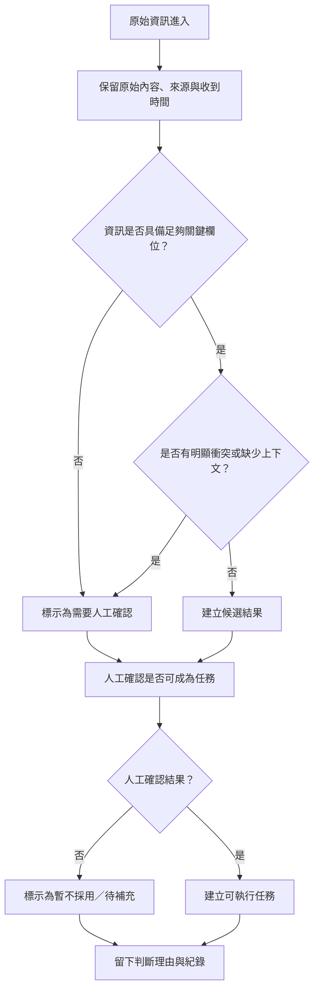

# 資訊流程設計

> 這份文件可以由 Codex 先產生草稿，但你必須用 VS Code 預覽 Mermaid，並由人檢查流程是否合理。

## 我的 v1 目標

- 我優先服務的使用者：行動者。
- 這個使用者最想完成的事：在不被模糊資訊誤導的情況下，快速判斷哪些資訊值得採取行動。
- 我最想避免的錯誤：把未確認、缺乏證據或可能過期的資訊當成可執行任務。

## 自然語言流程描述

原始資訊進來後，先保留原文、來源與收到時間。
系統先檢查資訊是否包含足夠的關鍵欄位，例如來源、時間、地點與確認方式。
如果資訊缺少關鍵欄位，或來源與內容有明顯衝突，就標示為需要人工確認，並暫時不建立候選結果。
如果資訊足夠且沒有明顯衝突，就建立候選結果，但仍然不直接視為已確認任務。
任何候選結果或拒絕採用，都要留下判斷理由與判斷者。
最後由人工確認是否可以成為可執行任務；若不能，則保留為待補充或暫不採用。

## Mermaid 流程圖

## 人工確認點

- 資訊是否足夠形成候選結果。
- 是否存在來源不明、時間不明、地點不明或內容衝突。
- 是否可由人工判定為可執行任務。

## 不能自動處理的分支

- 缺少來源或確認方式的資訊。
- 有明顯衝突或缺乏時間上下文的資訊。
- 不可由 AI 自動決定任務是否真實、是否需要派工，或優先順序。

## 操作或判斷紀錄

- 原始資訊與來源保留紀錄。
- 判斷者、判斷時間與判斷理由。
- 為什麼某筆內容被標記為需要人工確認或暫不採用。
- 最後是否建立任務及其對應證據。

## 我檢查後修正了什麼

- 原本：流程把「足夠資訊」與「可成為任務」混在一起，容易讓未確認資訊直接進入候選結果。
- 修正後：把流程拆成「先判斷是否足夠」與「再由人工確認是否可成為任務」兩個步驟。
- 為什麼：這樣能避免模糊資訊被誤當成可行動內容，也更符合設計檢查表中「不能把未確認資訊直接當成已確認」的要求。

## 我仍不確定的流程點

- 目前還不確定「多完整才算足夠」的門檻，可能要再用實際資料驗證。
- 仍需確認是否所有候選結果都要先經過人工確認，還是只有高風險內容才需要。
